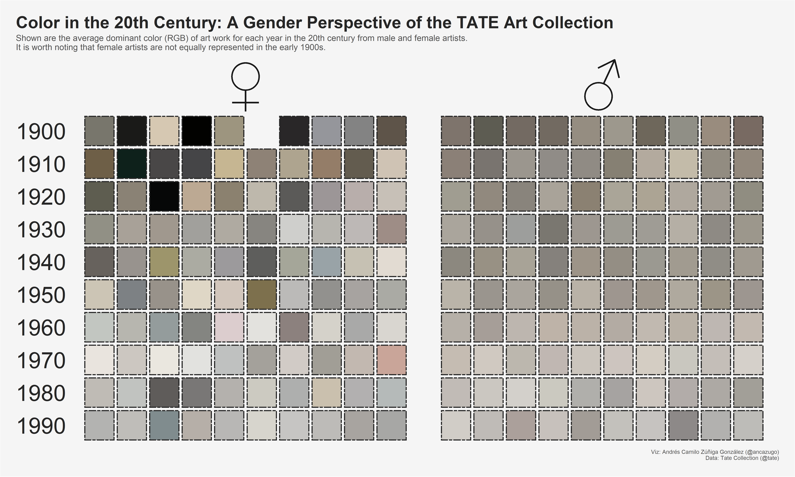

```{r packages, warning = FALSE, message=FALSE}
library(tidytuesdayR)
library(tidyverse)
library(colorfindr)
library(parallel)
# library(magick)
# library(imager)
# library(colorspace)
# library(scales)
```

```{r data, warning = FALSE, message=FALSE, results='hide'}
artwork <- tt_load('2021-01-12')$artwork
artists <- tt_load('2021-01-12')$artists

artists$name <- NULL
colnames(artists)[1] <- 'artistId'

df <- left_join(x = artwork, y = artists, by = 'artistId')
```

```{r art_20th_df}
art_20th_df <- df %>%
  filter(!is.na(thumbnailUrl), year >= 1900 & year < 2000) %>%
  select(title, artist, gender, year, thumbnailUrl)
```

```{r hex_function}
get_most_hex_color <- function(path) {
  out <- tryCatch({
    get_colors(path, top_n = 1, exclude_col = c('white', 'black'))$col_hex
    },
    
    warning <- function(cond) {
      message(paste("Reading the URL caused a warning:", path))
      message("Here's the original warning message:")
      message(paste(cond, '\n'))
      
      return(NA)
      },
    
    error = function(cond) {
      message(paste("This seems to be an invalid URL:", path))
      message("Here's the original error message:")
      message(paste(cond, '\n'))

      return(NA)
      }
    )
  return(out)
}
```

```{r hex_function_2, warning = FALSE, message=FALSE, echo=FALSE}
# get_most_hex_color <- function(path) {
#   image <- try(image_read(path), silent = T)
#   print(path)
#   if(class(image) == 'try-error') {
#     color <- ''
#   }
#   else if(class(image) == 'magick-image') {
#     color <- image %>% 
#     image_quantize(1, "RGB") %>%
#     image_resize('100') %>%
#     magick2cimg() %>% 
#     as.data.frame(wide = "c") %>% 
#     slice(1) %>% 
#     mutate(hex = hsv(rescale(c.1, from = c(0, 360)), c.2, c.3)) %>%
#     count(hex, sort = T) %>% 
#     pull(hex)
#   }
#   
#   return(color)
# }
```

```{r parallel, eval=FALSE}
system.time({
  ncores <- detectCores()
  cl <- makePSOCKcluster(ncores)
  
  # clusterEvalQ(cl, library(magick))
  # clusterEvalQ(cl, library(imager))
  # clusterEvalQ(cl, library(tidyverse))
  # clusterEvalQ(cl, library(scales))
  clusterEvalQ(cl, library(colorfindr))
  clusterExport(cl, "art_20th_df")
  
  start <- Sys.time()
  
  hex_colors <- parSapply(cl, art_20th_df$thumbnailUrl, get_most_hex_color)
  
  stopCluster(cl)
  
  end <- Sys.time()
  time <- end - start
  time
})
```

```{r color_df, eval=FALSE}
art_20th_df$hex_color <- hex_colors
names(art_20th_df$hex_color) <- NULL
art_20th_df <- art_20th_df %>%
  filter(!is.na(year), !is.na(hex_color), !is.na(gender)) 

rgb_colors <- col2rgb(art_20th_df$hex_color)
art_20th_df$red <- rgb_colors[1,]
art_20th_df$green <- rgb_colors[2,]
art_20th_df$blue <- rgb_colors[3,]

hsv_colors <- rgb2hsv(art_20th_df$red, art_20th_df$red, art_20th_df$blue) 
art_20th_df$hue <- hsv_colors[1,]
art_20th_df$saturation <- hsv_colors[2,]
art_20th_df$value <- hsv_colors[3,]

saveRDS(object = art_20th_df, file = 'art_20th_df.RDS')
```

```{r rds, warning = FALSE, message=FALSE, echo=FALSE}
art_20th_df <- readRDS('art_20th_df.RDS')
```


```{r color_grouped_df, warning = FALSE, message=FALSE}
color_grouped_df <- art_20th_df %>%
  group_by(year, gender) %>%
  summarise(red_avg = mean(red), green_avg = mean(green), blue_avg = mean(blue),
    hue_avg = mean(hue), saturation_avg = mean(saturation), value_avg = mean(value)) %>%
  mutate(hex_rgb_avg = rgb(red_avg, green_avg, blue_avg, maxColorValue = 255), 
         hex_hsv_avg = hsv(hue_avg, saturation_avg, value_avg))

color_grouped_df$decade <- cut(color_grouped_df$year, seq(1900, 2000, 10), include.lowest = T, right = F)
levels(color_grouped_df$decade) <- seq(1900, 1990, 10)

color_grouped_df$year_unit <- color_grouped_df$year %% 10
```


```{r plot, warning = FALSE, message=FALSE, eval=FALSE}
gender.labs <- c('♀', '♂') 
names(gender.labs) <- c('Female', 'Male')

ggplot(color_grouped_df, aes(x = year_unit, y = decade)) + 
  scale_y_discrete(limits = rev) +
  geom_tile(aes(fill = hex_rgb_avg, width = .9, height = .9), linetype = 'twodash', size = 1, colour = '#262626') +
  scale_fill_identity() +
  labs(title = 'Color in the 20th Century: A Gender Perspective of the TATE Art Collection',
       subtitle = 'Shown are the average dominant color (RGB) of art work for each year in the 20th century from male and female artists. \nIt is worth noting that female artists are not equally represented in the early 1900s.',
       caption = 'Viz: Andrés Camilo Zúñiga González (@ancazugo)\nData: Tate Collection (@tate)') +
  facet_grid(~gender, labeller = labeller(gender = gender.labs), scales = 'free') +
  theme(
    plot.background = element_rect(fill = '#f5f5f5'),
    plot.margin = unit(c(1, 1, 1, 1), "cm"),
    plot.title = element_text(face = 'bold', colour = '#262626', size = 30),
    plot.subtitle = element_text(colour = '#525252', size = 15),
    plot.caption = element_text(colour = '#525252', size = 10),
    plot.title.position = "plot",
    panel.background = element_rect(fill = '#f5f5f5'),
    panel.grid = element_blank(),
    axis.title = element_blank(),
    axis.ticks = element_blank(),
    axis.text.x = element_blank(),
    axis.text.y = element_text(size = 40, colour = '#262626'),
    strip.background = element_blank(),
    strip.text = element_text(face = 'bold', size = 100),
  )

ggsave('art_collection.png', device = 'png', width = 50, height = 30, units = 'cm', dpi = 300)
```

