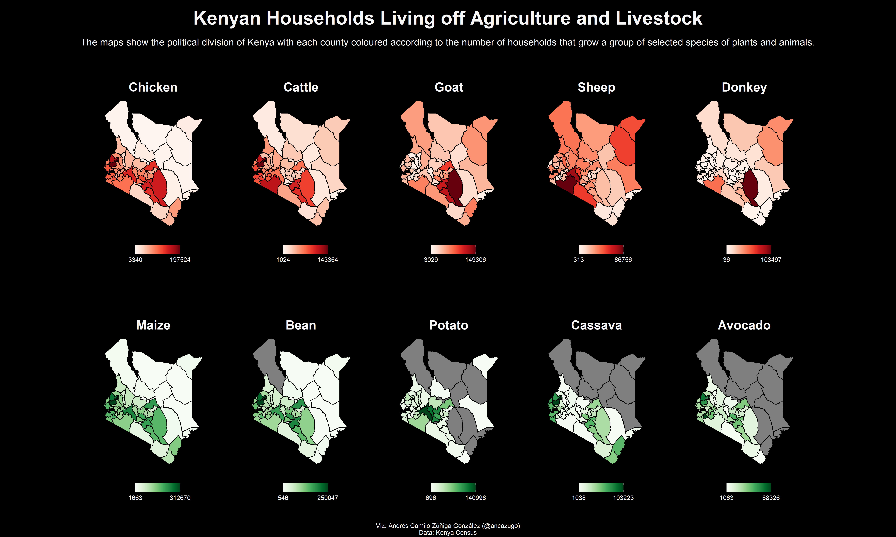

Week 4 - Kenya Census
================
Andres Camilo Zuñiga Gonzalez
24/01/21

``` r
library(tidyverse)
library(patchwork)
library(RColorBrewer)
library(rKenyaCensus)
library(sf)
library(ggtext)
```

``` r
kenya_sf <- st_as_sf(KenyaCounties_SHP)

crops_a <- V4_T2.21 %>%
    mutate(SubCounty = replace(SubCounty, SubCounty == 'NAIROBI', 'NAIROBI CITY'))

crops_b <- V4_T2.22 %>%
    filter(AdminArea == 'County') 

crops <- merge(crops_a, crops_b, by.x = 'SubCounty', by.y = 'County')
crops$SubCounty.y <- NULL
crops$Farming.y <- NULL
crops$AdminArea <- NULL
colnames(crops)[1:2] = c('County', 'Farming')

livestock <- V4_T2.23 %>% 
    filter(AdminArea == 'County')
livestock$SubCounty <- NULL
livestock$AdminArea <- NULL
```

``` r
crops_sf <- merge(kenya_sf, crops, by = 'County')
livestock_sf <- merge(kenya_sf, livestock, by = 'County')
```

``` r
theme_custom <- function() {
    theme(
        panel.background = element_rect(fill = '#000000'),
        plot.background = element_rect(fill = '#000000'),
        plot.margin = unit(c(2, 1, 1, 1), "cm"),
        plot.title = element_textbox_simple(face = 'bold', color = '#F7F7F7', size = 20, halign = 0.5, hjust = 0.5),
        plot.subtitle = element_text(colour = '#F7F7F7', size = 15, hjust = 0.5),
        plot.caption = element_text(colour = '#F7F7F7', size = 10),
        plot.caption.position = "plot",
        panel.grid = element_blank(),
        axis.text = element_blank(),
        axis.ticks = element_blank(),
        legend.background = element_rect(fill = '#000000'),
        legend.key = element_rect(fill = '#000000'),
        legend.title = element_text(face = 'bold', color = '#F7F7F7', size = 10),
        legend.text = element_text(color = '#F7F7F7', size = 10),
        legend.position = 'bottom',
        legend.spacing.x = unit(.5, "cm"),
        legend.key.size = unit(.5, "cm")
    )
}

theme_set(theme_custom())

border_color <- '#000000'

brewer_greens <- colorRampPalette(brewer.pal(9, 'Greens'))
brewer_reds <- colorRampPalette(brewer.pal(9, 'Reds'))
```

``` r
maize <- ggplot(crops_sf) + 
    geom_sf(aes(fill = as.numeric(Maize)), color = border_color) + 
    labs(title = "Maize") + 
    scale_fill_gradientn(colours = brewer_greens(20), name = NULL, breaks = as.integer)

beans <- ggplot(crops_sf) + 
    geom_sf(aes(fill = as.numeric(Beans)), color = border_color) + 
    labs(title = "Bean") + 
    scale_fill_gradientn(colours = brewer_greens(20), name = NULL, breaks = as.integer)

potato <- ggplot(crops_sf) + 
    geom_sf(aes(fill = as.numeric(Potatoes)), color = border_color) + 
    labs(title = "Potato") + 
    scale_fill_gradientn(colours = brewer_greens(20), name = NULL, breaks = as.integer)

cassava <- ggplot(crops_sf) + 
    geom_sf(aes(fill = as.numeric(Cassava)), color = border_color) + 
    labs(title = "Cassava") + 
    scale_fill_gradientn(colours = brewer_greens(20), name = NULL, breaks = as.integer)

avocado <- ggplot(crops_sf) + 
    geom_sf(aes(fill = as.numeric(Avocado)), color = border_color) + 
    labs(title = "Avocado") + 
    scale_fill_gradientn(colours = brewer_greens(20), name = NULL, breaks = as.integer)


crops_plots <- (maize | beans | potato | cassava | avocado)
```

``` r
chicken <- ggplot(livestock_sf) +
    geom_sf(aes(fill = as.numeric(IndigenousChicken)), color = border_color) + 
    labs(title = "Chicken") + 
    scale_fill_gradientn(colours = brewer_reds(20), name = NULL, breaks = as.integer)

cattle <- ggplot(livestock_sf) + 
    geom_sf(aes(fill = as.numeric(IndigenousCattle)), color = border_color) + 
    labs(title = "Cattle") + 
    scale_fill_gradientn(colours = brewer_reds(20), name = NULL, breaks = as.integer)

goat <- ggplot(livestock_sf) + 
    geom_sf(aes(fill = as.numeric(Goats)), color = border_color) + 
    labs(title = "Goat") + 
    scale_fill_gradientn(colours = brewer_reds(20), name = NULL, breaks = as.integer)

sheep <- ggplot(livestock_sf) + 
    geom_sf(aes(fill = as.numeric(Sheep)), color = border_color) + 
    labs(title = "Sheep") + 
    scale_fill_gradientn(colours = brewer_reds(20), name = NULL, breaks = as.integer)

donkey <- ggplot(livestock_sf) + 
    geom_sf(aes(fill = as.numeric(Donkeys)), color = border_color) + 
    labs(title = "Donkey") + 
    scale_fill_gradientn(colours = brewer_reds(20), name = NULL, breaks = as.integer)


livestock_plots <- (chicken | cattle | goat | sheep | donkey)
```

``` r
final_plot <- (livestock_plots / crops_plots) +
    plot_annotation(title = "Kenyan Households Living off Agriculture and Livestock",
                    subtitle = "The maps show the political division of Kenya with each county coloured according to the number of households that grow a group of selected species of plants and animals.",
                    caption = "Viz: Andrés Camilo Zúñiga González (@ancazugo)\nData: Kenya Census",
                    theme = theme(
                       plot.margin = unit(c(.1, .1, .1, .1), "cm"),
                       plot.title = element_textbox_simple(face = 'bold', color = '#F7F7F7', size = 30, halign = 0.5, hjust = 0.5, margin = unit(c(.5, .1, .5, .1), "cm")), 
                    ))

ggsave('kenya_census.png', final_plot, device = 'png', width = 50, height = 30, units = 'cm', dpi = 300)
```


